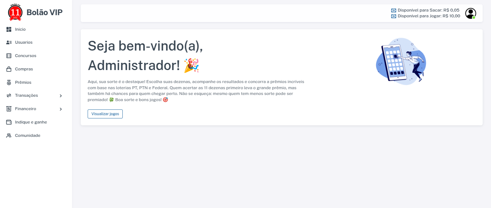
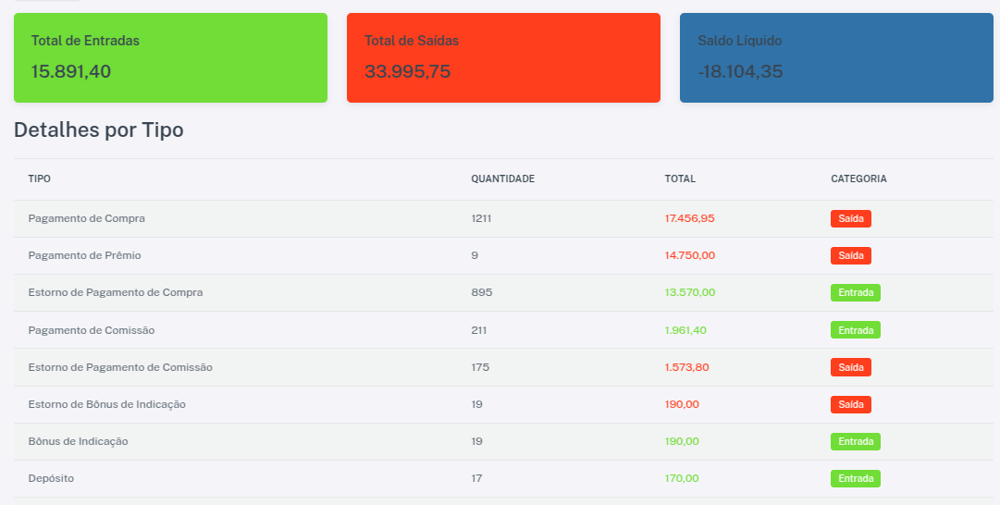

# README - Plataforma de Gerenciamento de Bolões

## 📌 Visão Geral
Plataforma web para gerenciamento de apostas em bolões, onde:
- **Bancas** cadastram **vendedores**
- **Vendedores** vendem números de jogos
- **Apostadores** compram números
- Resultados são publicados e premiados automaticamente


### Tela Principal


## ✨ Funcionalidades Principais

### 🎯 Controle de Apostas
- Cadastro de jogos e concursos
- Venda de números com limite de crédito por vendedor
- Geração de PDF com resultados e vencedores
- Sistema de repetição de apostas em concursos abertos

### 💰 Sistema Financeiro
- Controle de saldo (jogável e sacável)
- Comissão para vendedores
- Histórico de transações e extratos
- Pagamentos pendentes e confirmados



### 👥 Gerenciamento de Usuários
- Hierarquia: Admin > Banca > Vendedor > Apostador
- Limites de crédito por vendedor
- Comunidade de apostadores

## 🛠️ Melhorias Recentes (v1.2)
```markdown
✅ Formatação de números com 2 dígitos  
✅ Ordenação alfabética de jogos  
✅ Teclado numérico para seleção de dezenas  
✅ Filtros avançados para concursos abertos  
✅ Sistema de comissões para vendedores  
✅ Controle rigoroso de saldos e créditos  
✅ PDF de resultados otimizado  
✅ Fluxo de pagamento/estorno revisado  
✅ Interface com mais informações por página (20-50 jogos)  
```

## 🚀 Como Contribuir
1. Reporte bugs via Issues
2. Sugira melhorias com a tag [Feature]
3. Siga o padrão de commits semânticos

> **Note**: Projeto em evolução constante - documentação técnica detalhada disponível para contribuidores ativos.
